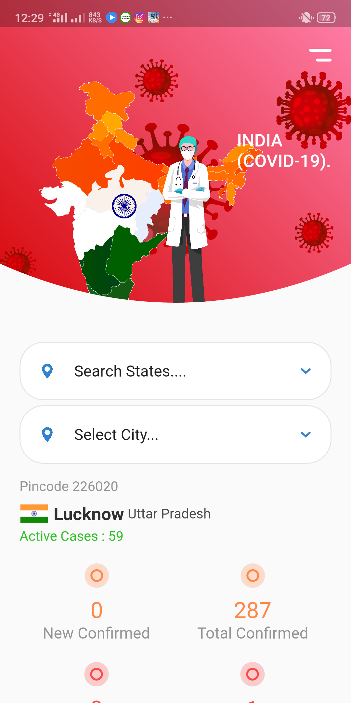

# covid-19 Tracker
This app is build in flutter and refers to current pandemic of Covid-19. This app is one stop to all your queries regarding this Coronavirus. This app updates daily informing about havoc caused by this virus throughout the world. 
 

## App Info
<ul>
<li><b>Version:</b> 1.0</li>
<li><b>Updated on:</b> May 2020</li>
<li><b>Size:</b> 20 MB</li>
<li><b>App permissions:</b> <ul> <li>Internet Connectivity</li> <li> Location Access</li> </ul></li></ul>

## Images
[Freepik](www.freepik.com)

## Usages
* Download and install the app from this [link](https://drive.google.com/file/d/1KydFZQ2p4q6_5gceXVrf1QBL6bo1TAzW/view?usp=sharing).
* Enable install from unknown sources.

Here are some screenshots of the app :  
 

