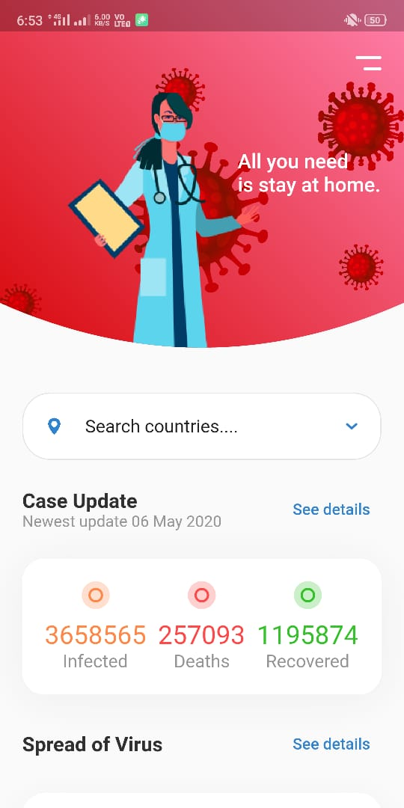
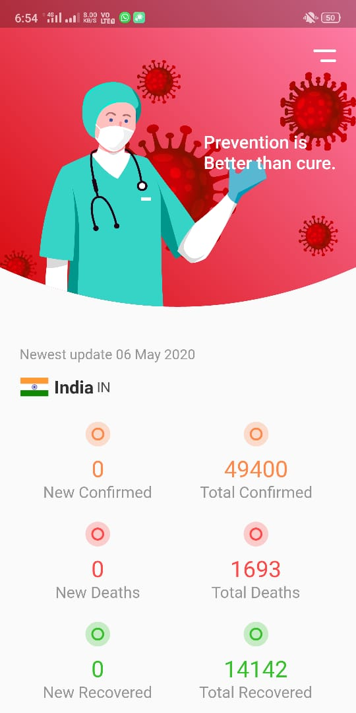
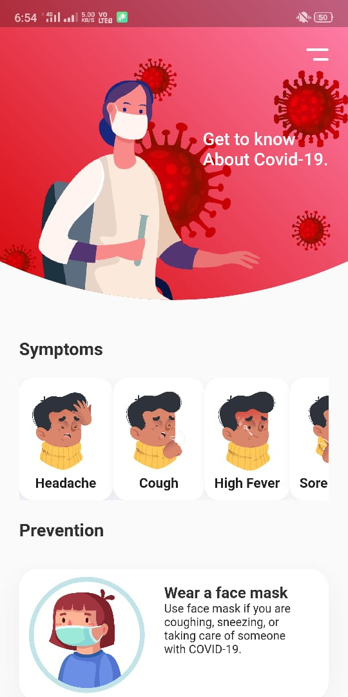
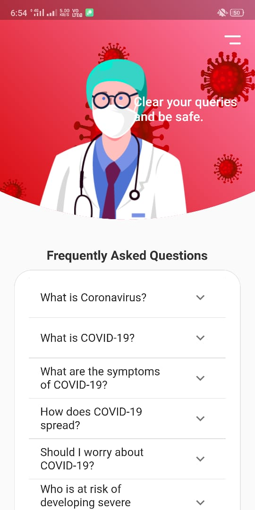

# covid-19 Tracker
This app is build in flutter and refers to current pandemic of Covid-19. This app is one stop to all your queries regarding this Coronavirus. This app updates daily informing about havoc caused by this virus throughout the world. 
 

## App Info
<b>Version:</b> 1.0 
<b>Updated on:</b> May 2020 
<b>Size:</b> 20 MB 
<b>App permissions:</b> Internet Connectivity  

## Images
[Freepik](www.freepik.com)

## Usages
* Download and install the app from this [link](https://drive.google.com/open?id=1Dg8oFWgr4APP6rVBkOb05M2Eg2hrkKdK).
* Enable install from unknown sources.

Here are some screenshots of the app :  
 

